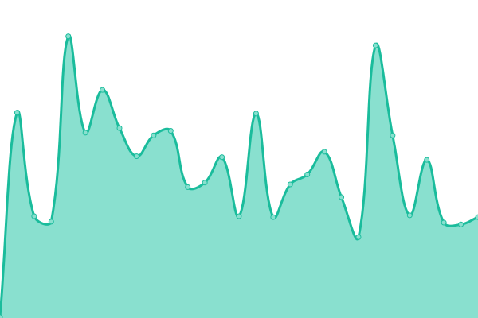
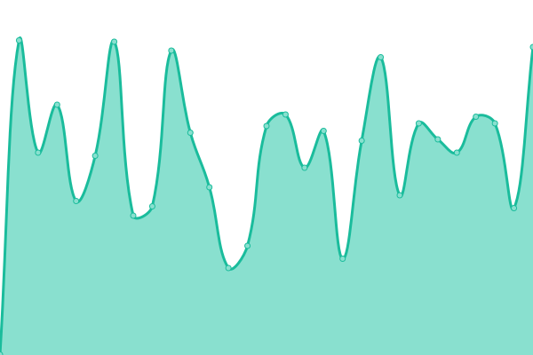
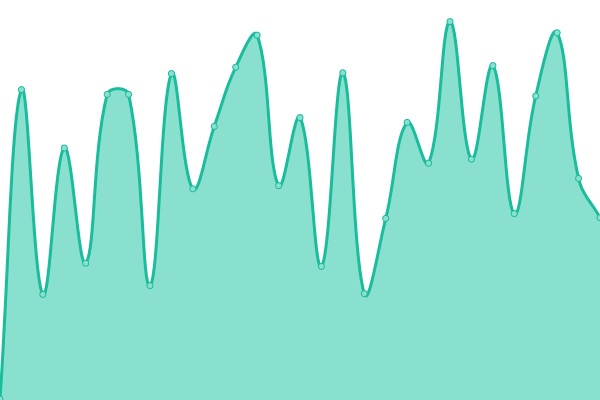
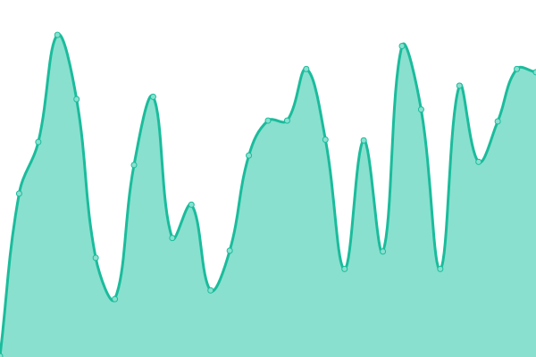
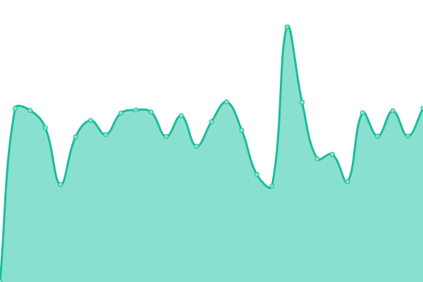
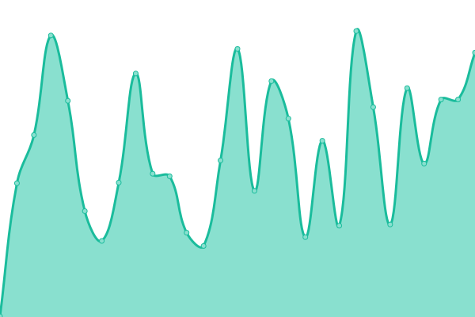
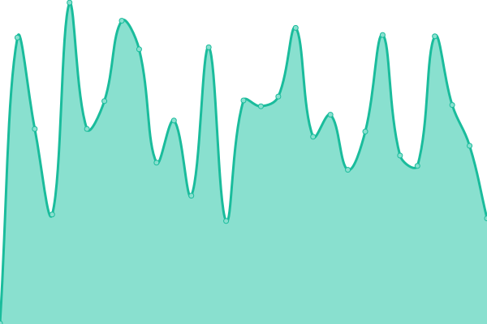
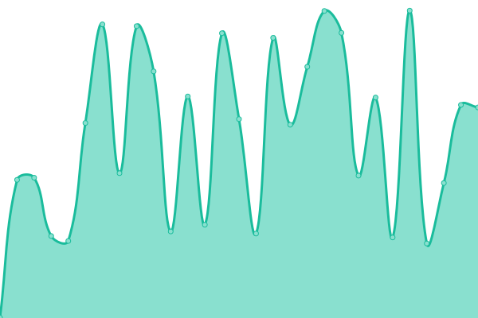

# [📈 Live Status](https://upptime.github.io/upptime): <!--live status--> **🟩 All systems operational**

This repository contains the open-source uptime monitor and status page for [Upptime](https://upptime.js.org), powered by [Upptime](https://github.com/upptime/upptime).

With [Upptime](https://upptime.js.org), you can get your own unlimited and free uptime monitor and status page, powered entirely by a GitHub repository. We use [Issues](https://github.com/upptime/upptime/issues) as incident reports, [Actions](https://github.com/rounders/up/actions) as uptime monitors, and [Pages](https://upptime.github.io/upptime) for the status page.

<!--start: status pages-->
<!-- This summary is generated by Upptime (https://github.com/upptime/upptime) -->
<!-- Do not edit this manually, your changes will be overwritten -->
<!-- prettier-ignore -->
| URL | Status | History | Response Time | Uptime |
| --- | ------ | ------- | ------------- | ------ |
|  [Rounders](https://www.rounders.ca) | 🟩 Up | [rounders.yml](https://github.com/rounders/up/commits/HEAD/history/rounders.yml) | 

 182ms
     
 | 

<a href="https://rounders.github.io/up/history/rounders">100.00%</a>
    

|  [How2ReachUs](https://how2reach.us) | 🟩 Up | [how2-reach-us.yml](https://github.com/rounders/up/commits/HEAD/history/how2-reach-us.yml) | 

 257ms
     
 | 

<a href="https://rounders.github.io/up/history/how2-reach-us">100.00%</a>
    

|  [BC Rare Bird Records](https://bcrarebirdrecords.ca) | 🟩 Up | [bc-rare-bird-records.yml](https://github.com/rounders/up/commits/HEAD/history/bc-rare-bird-records.yml) | 

 526ms
     
 | 

<a href="https://rounders.github.io/up/history/bc-rare-bird-records">100.00%</a>
    

|  [Alelucia](https://www.alelucia.com) | 🟩 Up | [alelucia.yml](https://github.com/rounders/up/commits/HEAD/history/alelucia.yml) | 

 331ms
     
 | 

<a href="https://rounders.github.io/up/history/alelucia">100.00%</a>
    

|  [Roost Dashboard](https://dashboard.roostsolar.com) | 🟩 Up | [roost-dashboard.yml](https://github.com/rounders/up/commits/HEAD/history/roost-dashboard.yml) | 

 264ms
     
 | 

<a href="https://rounders.github.io/up/history/roost-dashboard">100.00%</a>
    

|  [Like2Have.it](https://like2have.it) | 🟩 Up | [like2-have-it.yml](https://github.com/rounders/up/commits/HEAD/history/like2-have-it.yml) | 

 398ms
     
 | 

<a href="https://rounders.github.io/up/history/like2-have-it">100.00%</a>
    

|  [NaturesPicsOnline](https://www.naturespicsonline.com) | 🟩 Up | [natures-pics-online.yml](https://github.com/rounders/up/commits/HEAD/history/natures-pics-online.yml) | 

 287ms
     
 | 

<a href="https://rounders.github.io/up/history/natures-pics-online">100.00%</a>
    

|  [John Bentley Blog](https://blog.johnbentley.ca) | 🟩 Up | [john-bentley-blog.yml](https://github.com/rounders/up/commits/HEAD/history/john-bentley-blog.yml) | 

 338ms
     
 | 

<a href="https://rounders.github.io/up/history/john-bentley-blog">100.00%</a>
    

|  [Vancouver Now & Then](https://vancouvernowandthen.com/) | 🟩 Up | [vancouver-now-and-then.yml](https://github.com/rounders/up/commits/HEAD/history/vancouver-now-and-then.yml) | 

 591ms
     
 | 

<a href="https://rounders.github.io/up/history/vancouver-now-and-then">100.00%</a>
    

<!--end: status pages-->

[**Visit our status website →**](https://rounders.github.io/up)

## 📄 License

- Powered by: [Upptime](https://github.com/upptime/upptime)
- Code: [MIT](./LICENSE) © [Upptime](https://upptime.js.org)
- Data in the `./history` directory: [Open Database License](https://opendatacommons.org/licenses/odbl/1-0/)
